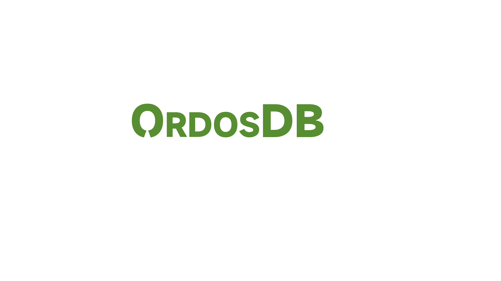

# OrdosDB

## AI-Empowered Massive Parallel Processing (MPP) Database

Hybrid MPP Database with AI Capabilities.

---

## 🚀 OrdosDB

### AI-Empowered Massive Parallel Processing (MPP) Database

Hybrid MPP Database with AI Capabilities.

---

### 🔘 Actions

- Start OrdosDB  
- View Docs  

---

## 🧠 OrdosDB Core Capabilities

### 1. LLM as First-Class Citizen as Relation
Build LLM-based relations on top of large language models.

---

### 2. SQL Extensions for LLM
LLM-related operations are embedded directly into SQL language.

---

### 3. LLM Analytics inside MPP Database
AI-native analytics functions inside the database engine.

---

### 4. Developer Friendly
- SQL support  
- Open API support  

---

### 5. On-Premise LLM
Enterprise data assets integrated with local LLM deployment.

---

### 6. OrdosDB Super Appliance
Integrated MPP + LLM release and installation appliance.

---

## 📌 Navigation

- Product  
- Architecture  
- Documentation  
- About OrdosDB  

---

## 📞 Contact

**Email:**  
ordosdb @ ordosdb.com.cn  

---

## 🌐 Community

- WeChat
  
- LinkedIn: https://www.linkedin.com/groups/20710026/  
- Twitter (X): https://twitter.com  

---

## © 2026 OrdosDB  
All rights reserved.
